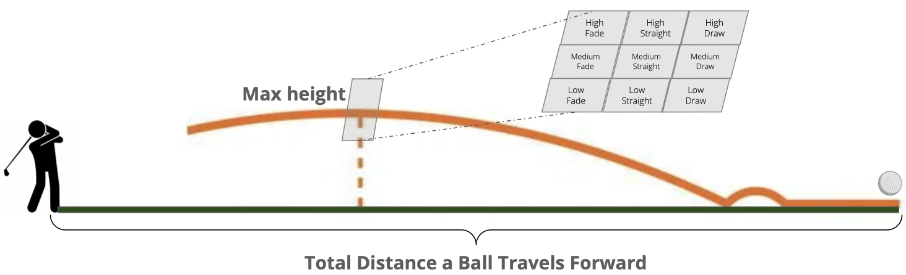

```{r setup, include=FALSE}
knitr::opts_chunk$set(echo = TRUE)
library(tidyverse)
library(kableExtra)
library(gam)
df_jan <- read_csv("Data Cleaning/Input Data/January 2024 TMAN fixed.csv")
df_feb <- read_csv("Data Cleaning/Input Data/February 2024 TMAN fixed.csv")
df <- rbind(df_jan, df_feb)
males <- c(
    "Andrew", "Brian Xu", "Daniel Rodgers", "David Zhang", "Folker",
    "Hank", "Jack Sonne", "Jay Saluja", "Justin Chan", "Justin Luan",
    "Ryan Dannegger", "Simulation Player", "Stephen Dai", "Steven Shea"
)

df <- df %>%
    mutate(Sex = ifelse(Player %in% males, "Male", "Female"))
st_club <- c(
  "3 Wood", "5 Wood", "4 Iron", "5 Iron", "6 Iron", "7 Iron", "8 Iron", "9 Iron",
  "Pitching Wedge", "Driver", "Unknown Club"
)
# df with only standard clubs
df_st_club <- filter(df, Club %in% st_club)
```

# Introduction

Golf is a precision sport where each shot's success heavily relies on how the golfer interacts with their club. Perfecting each shot requires a deep understanding of a golf club's characteristics, specifically its club head parameters (CHPs). Despite advancements in golf technology, there's still a big gap in fine-tuning these parameters to boost golfer performance with standard golf clubs.

Being able to replicate the desired outcomes of shots using standard clubs with precisely optimized CHPs could greatly improve a golfer's performance. This approach meets the golfer's need for consistency and predictability during play, using clubs that meet standard specifications. This research is vital as it enables golfers of all levels to achieve their best by utilizing their equipment's parameters.

Most recent advancements in the field have focused on creating new technologies or tweaking club designs to enhance performance. However, these new innovations often require golfers to adjust to different equipment styles or technologies. There remains a lack of thorough analysis on maximizing the performance of standard golf clubs by optimally adjusting their parameters —— Angle of Attack, Club Path Angle, Lie Angle, Shaft Lean, Club Face Angle, and Club Head Speed.

This research, led by MADS students at Carnegie Mellon University in partnership with golf startup company SquareFace, aims to carefully determine the best CHPs for producing the ideal trajectories and results for the nine standard shot shapes in golf. By exploring how each parameter affects different shot types, this study is set to offer essential insights that can significantly boost performance using existing clubs. Through this research, we are looking to bridge the gap between theoretical golf principles and the practical needs of golfers aiming to improve their game with standard equipment.

# Methods

### Data
The data were collected from the CMU golf team using TrackMan, a radar that reports the CHPs of each shot given the ball's trajectory. The data were collected in January and February of 2024. There were a total of 14,517 shots recorded however there are several limitations that should be noted.

First, 6,446 of the shots were reported to be hit with an “Unknown Club” which is problematic because the CHPs we are trying to find are unique to each club type. In our methods section, we will discuss how we tried to use classification methods to remedy this issue and predict what these clubs actually are. Ultimately, we were not able to classify with confidence and we did not use these 6,446 shots in our final results.

Second, the distributions of club types used and number of shots taken by each player are extremely uneven. As seen in Figure 1, most of the shots taken, beside the unknown clubs, were driver shots and 7 iron shots with the other clubs having much smaller counts. In total, there were 18 known players who took shots. The minimum number of shots that a single player took was 26 and the maximum was 988. Moreover, the ratio of shots taken by males to shots taken by females is approximately 4 to 1 which means there is not much data to estimate the parameters for females. These data limitations should be noted throughout the explanation of this study and shot shapes with little data should be treated as less confident estimates and areas of future research.

```{r, echo=FALSE, out.width="75%", fig.align = 'center', fig.cap='There is an uneven distribution of both club type and sex.'}
# Plot frequency of club types for standard clubs
ggplot(df_st_club, aes(x = Club, fill=Sex)) +
  geom_bar() +
  labs(
    title = "Distribution of Club Type Counts",
    x = "Club Type",
    y = "Count"
  ) +
  theme_bw() +
  theme(axis.text.x = element_text(angle = 50, hjust = 1), panel.grid = element_blank())
```

```{r, echo=FALSE}
# Calculate Shaft Lean for all clubs in standard set
df_st_club <- df_st_club %>%
  mutate(shaft_lean = ifelse(Club == "Driver", 10.5 - `Dyn. Loft`,
    ifelse(Club == "4 Iron", 22 - `Dyn. Loft`,
      ifelse(Club == "5 Iron", 25 - `Dyn. Loft`,
        ifelse(Club == "6 Iron", 29 - `Dyn. Loft`,
          ifelse(Club == "7 Iron", 33 - `Dyn. Loft`,
            ifelse(Club == "8 Iron", 37 - `Dyn. Loft`,
              ifelse(Club == "9 Iron", 41 - `Dyn. Loft`,
                45 - `Dyn. Loft`
              )
            )
          )
        )
      )
    )
  ))

# Select response and predictor variables and omit NA values
df_st_club <- dplyr::select(df_st_club, "Club", "Club Speed", "Attack Angle", "Swing Plane", "Face Angle", "Club Path", "shaft_lean", "Max Height - Height", "Max Height - Side", "Max Height - Dist.", "Carry Flat - Length", "Carry Flat - Side", "Est. Total Flat - Length", "Est. Total Flat - Side", "Player", "Sex") %>%
    na.omit()

# ORIGINALLY 15
# The next few lines limit the data via our "good shot" criteria
df_st_club <- df_st_club %>%
  filter(!(Club == "Driver" & `Est. Total Flat - Side` > 15))

df_st_club <- df_st_club %>%
  filter(!(Club == "Driver" & `Est. Total Flat - Side` < -15))

df_st_club <- df_st_club %>%
    filter(!(Club == "Driver" & `Est. Total Flat - Length` > 310))

df_st_club <- df_st_club %>%
    filter(!(Club == "Driver" & `Est. Total Flat - Length` < 280))

df_st_club <- df_st_club %>%
  filter(!(Club == "9 Iron" & `Est. Total Flat - Side` > 5))

df_st_club <- df_st_club %>%
  filter(!(Club == "9 Iron" & `Est. Total Flat - Side` < -5))

df_st_club <- df_st_club %>%
  filter(!(Club == "8 Iron" & `Est. Total Flat - Side` > 5))

df_st_club <- df_st_club %>%
  filter(!(Club == "8 Iron" & `Est. Total Flat - Side` < -5))

df_st_club <- df_st_club %>%
  filter(!(Club == "7 Iron" & `Est. Total Flat - Side` > 7.5))

df_st_club <- df_st_club %>%
  filter(!(Club == "7 Iron" & `Est. Total Flat - Side` < -7.5))

df_st_club <- df_st_club %>%
  filter(!(Club == "6 Iron" & `Est. Total Flat - Side` > 7.5))

df_st_club <- df_st_club %>%
  filter(!(Club == "6 Iron" & `Est. Total Flat - Side` < -7.5))

df_st_club <- df_st_club %>%
  filter(!(Club == "5 Iron" & `Est. Total Flat - Side` > 10))

df_st_club <- df_st_club %>%
  filter(!(Club == "5 Iron" & `Est. Total Flat - Side` < -10))

df_st_club <- df_st_club %>%
  filter(!(Club == "4 Iron" & `Est. Total Flat - Side` > 10))

df_st_club <- df_st_club %>%
  filter(!(Club == "4 Iron" & `Est. Total Flat - Side` < -10))

df_st_club <- df_st_club %>%
  filter(!(Club == "Pitching Wedge" & `Est. Total Flat - Side` > 5))

df_st_club <- df_st_club %>%
  filter(!(Club == "Pitching Wedge" & `Est. Total Flat - Side` < -5))

# Filter out shots that do not go far for Irons
df_st_club <- filter(df_st_club, !(
    Club == "9 Iron" & `Est. Total Flat - Length` < quantile(
        filter(
            df_st_club, Club == "9 Iron"
        )$`Est. Total Flat - Length`, 0.10
    )
))

df_st_club <- filter(df_st_club, !(
    Club == "8 Iron" & `Est. Total Flat - Length` < quantile(
        filter(
            df_st_club, Club == "8 Iron"
        )$`Est. Total Flat - Length`, 0.10
    )
))

df_st_club <- filter(df_st_club, !(
    Club == "7 Iron" & `Est. Total Flat - Length` < quantile(
        filter(
            df_st_club, Club == "7 Iron"
        )$`Est. Total Flat - Length`, 0.10
    )
))

# Filter out Driver shots that go too far
df_st_club <- filter(df_st_club, !(
    Club == "7 Iron" & `Est. Total Flat - Length` > quantile(
        filter(
            df_st_club, Club == "7 Iron"
        )$`Est. Total Flat - Length`, 0.95
    )
))

df_st_club <- filter(df_st_club, !(
    Club == "6 Iron" & `Est. Total Flat - Length` < quantile(
        filter(
            df_st_club, Club == "6 Iron"
        )$`Est. Total Flat - Length`, 0.10
    )
))

df_st_club <- filter(df_st_club, !(
    Club == "5 Iron" & `Est. Total Flat - Length` < quantile(
        filter(
            df_st_club, Club == "5 Iron"
        )$`Est. Total Flat - Length`, 0.10
    )
))

df_st_club <- filter(df_st_club, !(
    Club == "4 Iron" & `Est. Total Flat - Length` < quantile(
        filter(
            df_st_club, Club == "4 Iron"
        )$`Est. Total Flat - Length`, 0.10
    )
))

df_st_club <- filter(df_st_club, !(
    Club == "Pitching Wedge" & `Est. Total Flat - Length` < quantile(
        filter(
            df_st_club, Club == "Pitching Wedge"
        )$`Est. Total Flat - Length`, 0.10
    )
))
```

### Data Cleaning
	
Before we estimate the parameters, the data needed to be cleaned. Specifically, we filtered shots that met the criteria of the nine shot shapes that we estimated parameters for. Given our data limitations, we need to be slightly lenient in this context. A common feature of a straight, fade, and draw is that they have the same final destination, a central target. The flight paths of the three shot shapes are dependent on the side arc curving back toward the target. We can account for this by limiting the data to shots that only land within a specified range indicative of the shots club type. For example, the average width of a fairway can range from approximately 30 to 40 yards. For a driver, assuming an ideal shot lands with a final side distance of 0 yards left or right from the target, a good shot for a driver can land either 15 yards to the left or right of the target side distance of 0 yards. Thus, if a shot by a driver does not land within a 30 yard side distance width, it should be excluded from the cleaned data. Refer to Table 1 to view the side distance widths for each club type to determine good shots. Our values for landing widths makes sense as they were suggested by our client SquareFace, however with different data this could be subject to tuning.

```{r, echo=FALSE}
Club <- c("Driver", "9 Iron", "8 Iron", "7 Iron", "Pitching Wedge")
Width <- c("30 yds", "10 yds", "10 yds", "15 yds", "10 yds")
width_table <- data.frame(Club, Width)

# Output kable
kable(width_table, escape = TRUE, caption = "Example Landing Widths for Club Types") %>%
  kable_styling(latex_options = "hold_position")
```

Another important aspect of data cleaning was to filter out shots that had unreasonable distances for a ball to travel given the club type. For example, a driver shot that only goes 5 yards is not a valid shot. Some clubs in the data also have outliers that travel unexpectedly far distances and these are removed as well. For each of the club types, from looking at the distributions, a percentage of the shortest shots and longest shots are removed from the cleaned data. This is to obtain more reasonable distributions of realistic golf shots. In the case of irons, approximately 10% (varying from iron to iron) of shots are removed for being too short and approximately 1% of shots are removed for being too long.

Finally, any shots with missing values, in regards to the parameters we are looking at, are removed from the data. After data cleaning, we end up with approximately 2,400 rows of usable “good” shots with varying counts for each club type and player. View Figure 2, to see how the distribution of shots changed after data cleaning. After removing unknown clubs, we lost 8,071 shots. When filtering for good shots, we then lost another 5,672 shots. This left us with a total of 2,399 good shots. In Figure 2, the consistent gap in shots is indicative of the farthest shots being hit by drivers relative to total distance hit by other clubs such as irons.

```{r, echo=FALSE, fig.cap='The distribution of shots is much more narrow as thousands of bad shots are filtered out.', figures-side, fig.show="hold", out.width="50%"}
ggplot(df, aes(x=`Est. Total Flat - Side`, y=`Est. Total Flat - Length`)) + 
    geom_point(alpha=0.2, col="red") +
        ylim(0,400) +
        xlim(-160,160) +
    labs(title="The Final Position of a Ball for All Shots in the Data",
         x= "Final Side Distance from Target (yds)",
         y= "Total Length Traveled Forward (yds)") +
  theme_bw() +
  theme(panel.grid = element_blank())

ggplot(df_st_club, aes(x=`Est. Total Flat - Side`, y=`Est. Total Flat - Length`)) + 
    geom_point(alpha=0.2, col="green") +
    ylim(0,400) +
    xlim(-160,160) +
    labs(title="The Final Position of a Ball for \"Good Shots\" Only",
         x= "Final Side Distance from Target (yds)",
         y= "Total Length Traveled Forward (yds)") +
  theme_bw() +
  theme(panel.grid = element_blank())

```

### Parameters of interest

Once again, the CHPs of interest are Angle of Attack, Club Path Angle, Lie Angle, Shaft Lean, Club Face Angle, and Club Head Speed. In the TrackMan data, Club Path Angle is just represented as just “Club Path” and Lie Angle is represented as “Swing Plane”. Shaft Lean is not directly available from the data and required an extra step to calculate. The formula to calculate shaft lean is as follows:
$$Shaft Lean = Static Loft - Dynamic Loft$$
Dynamic Loft is available in the data but Static Loft is not. Static Loft is fixed for each club but each club type has a small range of variation depending on the club brand. In this case, Static Loft for each club type is taken from the 2024 Apex Pro Irons Product Specs.

In terms of the ball’s position during a shot we have three main data points. The first is a ball's position at its maximum height. This is represented by a value for its height in the air and side distance from the target 0. This position will be used to classify which of the nine shot shapes the given shot is. The second is the ball’s Carry Flat which is where the ball is when it first touches the ground. This is represented by a value for its distance traveled forward and side distance from the target 0. Finally, we have the Total Flat which is its final location. This is represented by a value for its total distance traveled forward and side distance from the target 0. Total Flat was used when determining the good shot criteria in the data cleaning section.

## Defining the Shot Shape Quadrants

The shot shape quadrants are treated as a fluid window dependent on the total distance the ball traveled. These quadrants are computed based on the number of shots that fall between the first quartile, the median, and the third quartile with a given club as seen in Figure 4. This results in four sub-quardants to define fluid, consistent shot shapes with regards to four ranges of length a ball can travel.

```{r, echo=FALSE, warning=FALSE, out.width="95%", fig.align = 'center', fig.cap='The quadrants are defined by a balls position at the shot\'s maximum height.'}

```

```{r, echo=FALSE, warning=FALSE, out.width="75%", fig.align = 'center', fig.cap='Shots are divided evenly into fourths in order to set up fluid qudrants.'}
df_driver_lim <- filter(df_st_club, Club == "7 Iron" & Sex == "Male")

# Side model
driver_side_final <- gam::gam(`Max Height - Side` ~
                             gam::s(`Club Speed`) +
                             gam::s(`Attack Angle`) +
                             gam::s(`Swing Plane`) +
                             gam::s(`Face Angle`) +
                             gam::s(`Club Path`) +
                             gam::s(shaft_lean), data = df_driver_lim)

# Height model
driver_height_final <- gam::gam(`Max Height - Height` ~
                               gam::s(`Club Speed`) + 
                               gam::s(`Attack Angle`) + 
                               gam::s(`Swing Plane`) + 
                               gam::s(`Face Angle`) + 
                               gam::s(`Club Path`) + 
                               gam::s(shaft_lean), data = df_driver_lim)

# First distance quartile
q1_dist <- quantile(df_driver_lim$`Est. Total Flat - Length`, 0.25)
# Second Distance quartile
median_dist <- quantile(df_driver_lim$`Est. Total Flat - Length`, 0.50)
# Third Distance quartile
q3_dist <- quantile(df_driver_lim$`Est. Total Flat - Length`, 0.75)


# SEVEN IRON .8
# Girls 7 iron 1

# 0-25% of data, divide height standard deviation by this
sd_divisor_side_1 <- 1
# 25-50% of data, divde height standard deviation by this
sd_divisor_side_2 <- 1
# 0-25% of data, divide height standard deviation by this
sd_divisor_side_3 <- 1
# 25-100% of data, divide height standard deviation by this
sd_divisor_side_4 <- 1

# Seven Iron 2
# Girls 7 iron 1

# 0-25% of data, divide height standard deviation by this
sd_divisor_height_1 <- 2
# 25-50% of data, divide height standard deviation by this
sd_divisor_height_2 <- 2
# 0-25% of data, divide height standard deviation by this
sd_divisor_height_3 <- 2
# 25-100% of data, divide height standard deviation by this
sd_divisor_height_4 <- 2

# Split for drivers and fades by sign
df_driver_lim$side_class_acc <- ifelse(df_driver_lim$`Max Height - Side` > 0, "Draw", "Fade")

# Limit data to first quartile
df_driver_lim_side1 <- filter(df_driver_lim, `Est. Total Flat - Length` < q1_dist)
# Get standard deviation
sd_lim_side1 <- sd(df_driver_lim_side1$`Max Height - Side`)

# Limit data to second quartile
df_driver_lim_side2 <- filter(df_driver_lim, `Est. Total Flat - Length` >= q1_dist)
df_driver_lim_side2 <- filter(df_driver_lim_side2, `Est. Total Flat - Length` < median_dist)
# Get standard deviation
sd_lim_side2 <- sd(df_driver_lim_side2$`Max Height - Side`)

# Limit data to third quartile
df_driver_lim_side3 <- filter(df_driver_lim, `Est. Total Flat - Length` >= median_dist)
df_driver_lim_side3 <- filter(df_driver_lim_side3, `Est. Total Flat - Length` < q3_dist)
# Get standard deviation
sd_lim_side3 <- sd(df_driver_lim_side3$`Max Height - Side`)

# Limit data to fourth quartile
df_driver_lim_side4 <- filter(df_driver_lim, `Est. Total Flat - Length` >= q3_dist)
# Get standard deviation
sd_lim_side4 <- sd(df_driver_lim_side4$`Max Height - Side`)

# Classify straights
for (i in 1:nrow(df_driver_lim)) {
  # Check to see if shot is in q1
  if (df_driver_lim[i, "Est. Total Flat - Length"] < q1_dist) {
    # Classify as straight is criteria is met
    if (df_driver_lim[i, "Max Height - Side"] < sd_lim_side1/sd_divisor_side_1 &
      df_driver_lim[i, "Max Height - Side"] > -sd_lim_side1/sd_divisor_side_1) {
      # Accessing the 'side_class' column by name to assign "Straight"
      df_driver_lim[i, "side_class_acc"] <- "Straight"
    }
    # Check to see if shot is in q2
  } else if (df_driver_lim[i, "Est. Total Flat - Length"] < median_dist) {
    # Classify as straight is criteria is met
    if (df_driver_lim[i, "Max Height - Side"] < sd_lim_side2/sd_divisor_side_2 &
      df_driver_lim[i, "Max Height - Side"] > -sd_lim_side2/sd_divisor_side_2) {
      df_driver_lim[i, "side_class_acc"] <- "Straight"
    }
    # Check to see if shot is in q3
  } else if (df_driver_lim[i, "Est. Total Flat - Length"] < q3_dist) {
    # Classify as straight is criteria is met
    if (df_driver_lim[i, "Max Height - Side"] < sd_lim_side3/sd_divisor_side_3 &
      df_driver_lim[i, "Max Height - Side"] > -sd_lim_side3/sd_divisor_side_3) {
      df_driver_lim[i, "side_class_acc"] <- "Straight"
    }
    # Check to see if shot is in q4
  } else {
    # Classify as straight is criteria is met
    if (df_driver_lim[i, "Max Height - Side"] < sd_lim_side4/sd_divisor_side_4 &
      df_driver_lim[i, "Max Height - Side"] > -sd_lim_side4/sd_divisor_side_4) {
      df_driver_lim[i, "side_class_acc"] <- "Straight"
    }
  }
}

hist(df_driver_lim$`Est. Total Flat - Length`, breaks=25, main="Distribution of Total Distance a Ball Travels\n(7 Irons - Males)", xlab = "Distance Traveled Forward (yds)", col="lightgrey")
abline(v = q1_dist, col="red", lty= 2)
abline(v = median_dist, col="red",lty= 2)
abline(v = q3_dist, col="red",lty= 2)


# Define height class variable
df_driver_lim$height_class_acc <- "Medium"

# Limit data to first quartile
df_driver_lim_height1 <- filter(df_driver_lim, `Est. Total Flat - Length` < q1_dist)
# Get mean and standard deviation
mean_lim_height1 <- mean(df_driver_lim_height1$`Max Height - Height`)
mean_lim_height1 <- 93
sd_lim_height1 <- sd(df_driver_lim_height1$`Max Height - Height`)

# Limit data to second quartile
df_driver_lim_height2 <- filter(df_driver_lim, `Est. Total Flat - Length` >= q1_dist)
df_driver_lim_height2 <- filter(df_driver_lim_height2, `Est. Total Flat - Length` < median_dist)
# Get mean and standard deviation
mean_lim_height2 <- mean(df_driver_lim_height2$`Max Height - Height`)
mean_lim_height2 <- 93
sd_lim_height2 <- sd(df_driver_lim_height2$`Max Height - Height`)

# Limit data to third quartile
df_driver_lim_height3 <- filter(df_driver_lim, `Est. Total Flat - Length` >= median_dist)
df_driver_lim_height3 <- filter(df_driver_lim_height3, `Est. Total Flat - Length` < q3_dist)
# Get mean and standard deviation
mean_lim_height3 <- mean(df_driver_lim_height3$`Max Height - Height`)
mean_lim_height3 <- 93
sd_lim_height3 <- sd(df_driver_lim_height3$`Max Height - Height`)

# Limit data to fourth quartile
df_driver_lim_height4 <- filter(df_driver_lim, `Est. Total Flat - Length` >= q3_dist)
# Get mean and standard deviation
mean_lim_height4 <- mean(df_driver_lim_height4$`Max Height - Height`)
mean_lim_height4 <- 93
sd_lim_height4 <- sd(df_driver_lim_height4$`Max Height - Height`)

# Classify height
for (i in 1:nrow(df_driver_lim)) {
  # Check if shot is in distance q1
  if (df_driver_lim[i, "Est. Total Flat - Length"] < q1_dist) {
    # Classify as high/low/medium based on criteria
    if (df_driver_lim[i, "Max Height - Height"] > (mean_lim_height1 + sd_lim_height1 / sd_divisor_height_1)) {
      df_driver_lim[i, "height_class_acc"] <- "High"
    }
    if (df_driver_lim[i, "Max Height - Height"] < (mean_lim_height1 - sd_lim_height1 / sd_divisor_height_1)) {
      df_driver_lim[i, "height_class_acc"] <- "Low"
    }
    # Check if shot is in distance q1
  } else if (df_driver_lim[i, "Est. Total Flat - Length"] < median_dist) {
    # Classify as high/low/medium based on criteria
    if (df_driver_lim[i, "Max Height - Height"] > (mean_lim_height2 + sd_lim_height2 / sd_divisor_height_2)) {
      df_driver_lim[i, "height_class_acc"] <- "High"
    }
    if (df_driver_lim[i, "Max Height - Height"] < (mean_lim_height2 - sd_lim_height2 / sd_divisor_height_2)) {
      df_driver_lim[i, "height_class_acc"] <- "Low"
    }
    # Check if shot is in distance q1
  } else if (df_driver_lim[i, "Est. Total Flat - Length"] < q3_dist) {
    # Classify as high/low/medium based on criteria
    if (df_driver_lim[i, "Max Height - Height"] > (mean_lim_height3 + sd_lim_height3 / sd_divisor_height_3)) {
      df_driver_lim[i, "height_class_acc"] <- "High"
    }
    if (df_driver_lim[i, "Max Height - Height"] < (mean_lim_height3 - sd_lim_height3 / sd_divisor_height_3)) {
      df_driver_lim[i, "height_class_acc"] <- "Low"
    }
    # Check if shot is in distance q1
  } else {
    # Classify as high/low/medium based on criteria
    if (df_driver_lim[i, "Max Height - Height"] > (mean_lim_height4 + sd_lim_height4 / sd_divisor_height_4)) {
      df_driver_lim[i, "height_class_acc"] <- "High"
    }
    if (df_driver_lim[i, "Max Height - Height"] < (mean_lim_height4 - sd_lim_height4 / sd_divisor_height_4)) {
      df_driver_lim[i, "height_class_acc"] <- "Low"
    }
  }
}

# Choose the shot shape you want to investigate
shot_shape_df <- filter(df_driver_lim, side_class_acc == "Fade" & height_class_acc == "High")

# Create a data frame template to keep ideal parameters
df_ideal_driver <- data.frame(Club=character(), Height_Class=character(), Side_Class=character(),
                       Club_Path_Angle=double(), Lie_Angle=double(), Attack_Angle=double(),
                       Club_Speed=double(), Shaft_Lean=double(), Face_Angle=double())

# Lists for shot shapes
heights = c("High", "Medium", "Low")
sides = c("Draw", "Straight", "Fade")

# Variable for row iterator
row = 1

# Loop though each shot shape combination
for (height in heights){
    for (side in sides){
        # Filter to only specific shot shape
        shot_shape_df <- filter(df_driver_lim, side_class_acc == side & height_class_acc == height)
        
        # Store club and shot shape
        df_ideal_driver[row, "Club"] <- "Driver"
        df_ideal_driver[row, "Height_Class"] <- height
        df_ideal_driver[row, "Side_Class"] <- side
        
        # Get ideal parameters from medians
        df_ideal_driver[row, "Club_Path_Angle"] <- median(shot_shape_df$`Club Path`)
        df_ideal_driver[row, "Lie_Angle"] <- median(shot_shape_df$`Swing Plane`)
        df_ideal_driver[row, "Attack_Angle"] <- mean(shot_shape_df$`Attack Angle`)
        df_ideal_driver[row, "Club_Speed"] <- mean(shot_shape_df$`Club Speed`)
        df_ideal_driver[row, "Shaft_Lean"] <- mean(shot_shape_df$shaft_lean)
        df_ideal_driver[row, "Face_Angle"] <- mean(shot_shape_df$`Face Angle`)
        
        # Iterate to next row
        row = row + 1
    }
}

# Create dummy data frame that matches with visualization
df_ideal_driver_mutated <- df_ideal_driver
colnames(df_ideal_driver_mutated) <- c("Club", "Height_Class", "Side_Class",
                                       "Club Path", "Swing Plane", "Attack Angle",
                                       "Club Speed", "shaft_lean", "Face Angle")

# Get predictions from moedls
side_preds <- predict(driver_side_final, df_ideal_driver_mutated)
height_preds <- predict(driver_height_final, df_ideal_driver_mutated)

# Data frame with predicted spot in air
predictions_quad <- data.frame(side_preds, height_preds)

# Get side means for each shot shape
side_mean <- c(
    mean(filter(df_driver_lim, side_class_acc == "Draw" & height_class_acc == "High")$`Max Height - Side`),
    mean(filter(df_driver_lim, side_class_acc == "Straight" & height_class_acc == "High")$`Max Height - Side`),
    mean(filter(df_driver_lim, side_class_acc == "Fade" & height_class_acc == "High")$`Max Height - Side`),
    mean(filter(df_driver_lim, side_class_acc == "Draw" & height_class_acc == "Medium")$`Max Height - Side`),
    mean(filter(df_driver_lim, side_class_acc == "Straight" & height_class_acc == "Medium")$`Max Height - Side`),
    mean(filter(df_driver_lim, side_class_acc == "Fade" & height_class_acc == "Medium")$`Max Height - Side`),
    mean(filter(df_driver_lim, side_class_acc == "Draw" & height_class_acc == "Low")$`Max Height - Side`),
    mean(filter(df_driver_lim, side_class_acc == "Straight" & height_class_acc == "Low")$`Max Height - Side`),
    mean(filter(df_driver_lim, side_class_acc == "Fade" & height_class_acc == "Low")$`Max Height - Side`)
              )

# Get height means for each shot shape
height_mean <- c(
    mean(filter(df_driver_lim, side_class_acc == "Draw" & height_class_acc == "High")$`Max Height - Height`),
    mean(filter(df_driver_lim, side_class_acc == "Straight" & height_class_acc == "High")$`Max Height - Height`),
    mean(filter(df_driver_lim, side_class_acc == "Fade" & height_class_acc == "High")$`Max Height - Height`),
    mean(filter(df_driver_lim, side_class_acc == "Draw" & height_class_acc == "Medium")$`Max Height - Height`),
    mean(filter(df_driver_lim, side_class_acc == "Straight" & height_class_acc == "Medium")$`Max Height - Height`),
    mean(filter(df_driver_lim, side_class_acc == "Fade" & height_class_acc == "Medium")$`Max Height - Height`),
    mean(filter(df_driver_lim, side_class_acc == "Draw" & height_class_acc == "Low")$`Max Height - Height`),
    mean(filter(df_driver_lim, side_class_acc == "Straight" & height_class_acc == "Low")$`Max Height - Height`),
    mean(filter(df_driver_lim, side_class_acc == "Fade" & height_class_acc == "Low")$`Max Height - Height`)
              )

shot_shape <- c("High Draw", "High Straight", "High Fade",
                "Medium Draw", "Medium Straight", "Medium Fade",
                "Low Draw", "Low Straight", "Low Fade")

# Put means in dataframe
means_quad <- data.frame(side_mean, height_mean)
```

For the low, medium, and high shots criteria, the bounds to determine these are an adjusted fraction of a standard deviation above and below the mean height that PGA/LPGA golfers hit for each club type (taken from golf.com recordings in 2021). The quadrant boundaries that determine the distance between a fade straight and draw are determined by an adjusted fraction of a standard deviation to the left or right of the side distance target 0. See Figure 5 to view what a fluid quadrant looks like. In the case of 7 irons (males), the quadrants are half of a standard away from their center both vertically and horizontally.

```{r, echo=FALSE, warning=FALSE, out.width="85%", fig.align = 'center', fig.cap='This is an example of a fluid quadrant put together. The pink dots are representative of the mean position of the ball in the air for each quadrant. Each line is representative of one of the 4 fluid quadrants.'}
# Visualize all quadrants with the parameters landing via model
ggplot(df_driver_lim, aes(x = `Max Height - Side`, y = `Max Height - Height`)) +
    ylim(50,150) +
    xlim(-16,16) +
  geom_point(alpha = 0.2) +
  geom_vline(aes(xintercept = -sd_lim_side1/sd_divisor_side_1), col = "green") +
  geom_vline(aes(xintercept = sd_lim_side1/sd_divisor_side_1), col = "green") +
  geom_vline(aes(xintercept = -sd_lim_side2/sd_divisor_side_2), col = "yellow") +
  geom_vline(aes(xintercept = sd_lim_side2/sd_divisor_side_2), col = "yellow") +
  geom_vline(aes(xintercept = -sd_lim_side3/sd_divisor_side_3), col = "orange") +
  geom_vline(aes(xintercept = sd_lim_side3/sd_divisor_side_3), col = "orange") +
  geom_vline(aes(xintercept = -sd_lim_side4/sd_divisor_side_4), col = "red") +
  geom_vline(aes(xintercept = sd_lim_side4/sd_divisor_side_4), col = "red") +
  geom_hline(aes(yintercept = (mean_lim_height1 + sd_lim_height1 / sd_divisor_height_1)), col = "green") +
  geom_hline(aes(yintercept = (mean_lim_height1 - sd_lim_height1 / sd_divisor_height_1)), col = "green") +
  geom_hline(aes(yintercept = (mean_lim_height2 + sd_lim_height2 / sd_divisor_height_2)), col = "yellow") +
  geom_hline(aes(yintercept = (mean_lim_height2 - sd_lim_height2 / sd_divisor_height_2)), col = "yellow") +
  geom_hline(aes(yintercept = (mean_lim_height3 + sd_lim_height3 / sd_divisor_height_3)), col = "orange") +
  geom_hline(aes(yintercept = (mean_lim_height3 - sd_lim_height3 / sd_divisor_height_3)), col = "orange") +
  geom_hline(aes(yintercept = (mean_lim_height4 + sd_lim_height4 / sd_divisor_height_4)), col = "red") +
  geom_hline(aes(yintercept = (mean_lim_height4 - sd_lim_height4 / sd_divisor_height_4)), col = "red") +
  labs(
    title = "Distribution of Shots at Max Height for a 7 Iron - Males",
    subtitle = "Shot shape quadrants dependent on the distance a ball travels",
    y = "Height (ft)",
    x = "Side Distance (ft)"
  ) +
    geom_text(x = -12, y = 145, label = "Fade") +
    geom_text(x = 0, y = 145, label = "Straight") +
    geom_text(x = 12, y = 145, label = "Draw") +
  theme(
    panel.grid.major = element_blank(), panel.grid.minor = element_blank(),
    panel.background = element_blank(), axis.line = element_line(colour = "black")
  ) +
  geom_point(data = means_quad, aes(x = side_mean, y = height_mean), color = "violet", pch=19, size=7)

```


### Building a Model for Validation

The models we used to predict a ball’s position in the air are generalized additive models (GAMs). A GAM is a modeling process where, in this case, a continuous variable is predicted using a function to smooth each predictor variable. We found that this performs better than linear regression as there are some nonlinear relationships between the response and predictors that would be captured with ordinary least squares regression. These smoothing functions, known as splines, fit the predictors as polynomial curves when necessary to said predictor. For each club type and sex, there are two GAMs: one predicting the balls height in the air at max height and one predicting the balls side distance in the air at max height. Each predictor variable is fit with a smoothing spline and it is tested if variable selection improves the model.

### Player Random Effects

In our study, we aimed to evaluate the impact of individual player characteristics on the performance of golf shots using two types of clubs: the driver and the 7 iron. Recognizing that each player's physical abilities, techniques, and consistency can vary significantly, we hypothesized that incorporating Player Random Effects into our models might allow us to capture this individual variability.

To evaluate the significance of Player Random Effects on our study's key parameters, we developed two distinct Generalized Additive Models (GAMs). The first model included only six essential parameters, whereas the second model expanded on these by incorporating Player Random Effects. The specific question we addressed with this approach was: 'Does including Player Random Effects in the model provide a more accurate and personalized representation of how different players' characteristics influence the outcomes of their shots?' 

We conducted hypothesis testing between the two models to assess the impact of including Player Random Effects. Specifically, our null hypothesis was that the inclusion of these effects does not significantly alter the parameter estimates, against the alternative hypothesis that it does. We utilized the resulting p-values as a measure of significance.

* If the p-value is less than 0.05, this indicates that the inclusion of Player Random Effects significantly impacts the parameter estimates, supporting the alternative hypothesis.

* If the p-value is 0.05 or greater, this suggests that the inclusion of Player Random Effects does not significantly change the parameter estimates, supporting the null hypothesis.

This approach allows us to determine whether models tailored to individual player characteristics are necessary for accurate predictions of shot outcomes, or if a general model is sufficient for the purposes of coaching and equipment customization.


### Unknown Club Classification

As mentioned in the Data Cleaning section, approximately half of the data had club classifications of “Unknown Club”. Since knowing the club type is essential for determining the ideal CHPs, we attempted to build predictive models to classify clubs listed as “Unknown Club” in order to utilize our entire dataset. First, we used the original data and filtered for clubs that were known. We then split the known clubs into 80% training data and 20% test data. 

We built random forest and xgBoost models with a feature set that included  Club Path Angle, Max Height Distance, Max Height, Ball Speed, Club Speed, Player Id, Attack Angle, Dynamic Lie and Dynamic Loft. Both of these models were performed with 10 fold cross validation. 

After training and testing the model on the known clubs, the random forest model was used to predict on the unknown clubs. Predicting the unknown clubs results in the following club counts in Table 2. After making these predictions, we proceeded to build the gam model on the predicted driver clubs. We assessed the validity of these predictions by comparing the model summary and CHPs of the predicted clubs against the model summary and the CHPs of the known clubs.

```{r, echo=FALSE}
club_counts <- data.frame(
  Club = c("4 Iron", "5 Iron", "6 Iron", "7 Iron", "8 Iron", "9 Iron", "Driver", "Pitching Wedge"),
  Count = c(1, 26, 17, 814, 285, 377, 1327, 2147)
)

# Output kable
kable(club_counts, escape = TRUE, caption = "Counts of Different Clubs from Random Forest Prediction") %>%
  kable_styling(latex_options = "hold_position")

```

# Results

### Extracting Parameters

When extracting parameters, we used the medians of the distributions of parameters for each shot shape given the club used and the sex of the player. See Figure 6 to view an example of these distributions for a specific shot shape. Through this, we found that our estimates were in the ballpark of what was expected for these parameters. After discussion with a client that has extensive knowledge of the sport and CHPs, we found that club types with lacking data were affected heavily by the data limitations discussed earlier. For example, it was discovered that most of the shots taken with drivers were classified as high and medium straights. Moreover, there is essentially little to no data for fades and draws hit by drivers thus there is no ability to report the parameters for said shot shapes. To see an example of their extracted parameters, see Table 3.

```{r, echo=FALSE, out.width="80%", fig.align = 'center', fig.cap='The parameters for each shot shape are extracted from the medians of the parameter distributions from quadrant to quadrant.'}
# Choose the shot shape you want to investigate
shot_shape_df <- filter(df_driver_lim, side_class_acc == "Fade" & height_class_acc == "High")
par(mfrow = c(2, 3), oma = c(0, 0, 3, 0))

# Create a histogram for all parameters of a chosen shot shape
hist(shot_shape_df$`Club Speed`, breaks = 10, main = "Club Speed", xlab = "Club Speed (mph)")
abline(v = median(shot_shape_df$`Club Speed`), col = "red", lty=2)
hist(shot_shape_df$`Attack Angle`, breaks = 10, main = "Attack Angle", xlab = "Attack Angle (degrees)")
abline(v = median(shot_shape_df$`Attack Angle`), col = "red", lty=2)
hist(shot_shape_df$`Swing Plane`, breaks = 10, main = "Swing Plane", xlab = "Swing Plane (degrees)")
abline(v = median(shot_shape_df$`Swing Plane`), col = "red", lty=2)
hist(shot_shape_df$`Face Angle`, breaks = 10, main = "Face Angle", xlab = "Face Angle (degrees)")
abline(v = median(shot_shape_df$`Face Angle`), col = "red", lty=2)
hist(shot_shape_df$`Club Path`, breaks = 10, main = "Club Path", xlab = "Club Path (degrees)")
abline(v = median(shot_shape_df$`Club Path`), col = "red", lty=2)
hist(shot_shape_df$shaft_lean, breaks = 10, main = "Shaft Lean", xlab = "Shaft Lean (degrees)")
abline(v = median(shot_shape_df$shaft_lean), col = "red", lty=2)

mtext("Distributions of Shot Shape Parameter for a High Fade\n(7 Iron - Males)", outer = TRUE, cex = 1)
```

```{r, echo=FALSE}
# Dummy df for sharing table
df_ideal_driver_sharable <- data.frame(
    Shot_Shape = paste(df_ideal_driver$Height_Class,df_ideal_driver$Side_Class),
    Club_Path_Angle = df_ideal_driver$Club_Path_Angle,
    Lie_Angle = df_ideal_driver$Lie_Angle,
    Attack_Angle = df_ideal_driver$Attack_Angle,
    Club_Speed = df_ideal_driver$Club_Speed,
    Shaft_Lean = df_ideal_driver$Shaft_Lean,
    Face_Angle = df_ideal_driver$Face_Angle)

# Output kable
kable(df_ideal_driver_sharable, escape = TRUE, caption = "Ideal Parameter Estimates for 7 Iron (Males) From Centers of Actual Data.") %>%
  kable_styling(latex_options = "hold_position")
```

### GAM Performance

It was found that in GAMs for both side and height, when using a smoothing spline on all six predictor variables, the mean squared error was consistently the lowest when compared to GAMs after variable selection. Even when considering all standard clubs combined, the GAM for side distance has an extremely small mean squared error of 13.7 ft. Refer to Figure 7 to view how well the GAM performs when fitting the extracted parameters when compared to the expected position in the air. When looking at the visualization, note that the blue dots indicate where the GAM is placing the predicted parameters.

```{r, echo=FALSE, warning=FALSE, out.width="75%", fig.align = 'center', fig.cap='The blue circles are where the GAMs estimate the ball to land given the extracted parameters for each shot shape. These blue circles represent how closely the GAM is fitting the CHPs to the median CHPs from the actual data.'}
# Visualize all quadrants with the parameters landing via model
ggplot(df_driver_lim, aes(x = `Max Height - Side`, y = `Max Height - Height`)) +
    ylim(50,155) +
    xlim(-16,16) +
  geom_point(alpha = 0.2) +
  geom_vline(aes(xintercept = -sd_lim_side1/sd_divisor_side_1), col = "green") +
  geom_vline(aes(xintercept = sd_lim_side1/sd_divisor_side_1), col = "green") +
  geom_vline(aes(xintercept = -sd_lim_side2/sd_divisor_side_2), col = "yellow") +
  geom_vline(aes(xintercept = sd_lim_side2/sd_divisor_side_2), col = "yellow") +
  geom_vline(aes(xintercept = -sd_lim_side3/sd_divisor_side_3), col = "orange") +
  geom_vline(aes(xintercept = sd_lim_side3/sd_divisor_side_3), col = "orange") +
  geom_vline(aes(xintercept = -sd_lim_side4/sd_divisor_side_4), col = "red") +
  geom_vline(aes(xintercept = sd_lim_side4/sd_divisor_side_4), col = "red") +
  geom_hline(aes(yintercept = (mean_lim_height1 + sd_lim_height1 / sd_divisor_height_1)), col = "green") +
  geom_hline(aes(yintercept = (mean_lim_height1 - sd_lim_height1 / sd_divisor_height_1)), col = "green") +
  geom_hline(aes(yintercept = (mean_lim_height2 + sd_lim_height2 / sd_divisor_height_2)), col = "yellow") +
  geom_hline(aes(yintercept = (mean_lim_height2 - sd_lim_height2 / sd_divisor_height_2)), col = "yellow") +
  geom_hline(aes(yintercept = (mean_lim_height3 + sd_lim_height3 / sd_divisor_height_3)), col = "orange") +
  geom_hline(aes(yintercept = (mean_lim_height3 - sd_lim_height3 / sd_divisor_height_3)), col = "orange") +
  geom_hline(aes(yintercept = (mean_lim_height4 + sd_lim_height4 / sd_divisor_height_4)), col = "red") +
  geom_hline(aes(yintercept = (mean_lim_height4 - sd_lim_height4 / sd_divisor_height_4)), col = "red") +
  labs(
    title = "Distribution of Shots at Max Height for a 7 Iron - Males",
    subtitle = "Shot shape quadrants dependent on the distance a ball travels",
    y = "Height (ft)",
    x = "Side Distance (ft)"
  ) +
    geom_text(x = -12, y = 150, label = "Fade") +
    geom_text(x = 0, y = 150, label = "Straight") +
    geom_text(x = 12, y = 150, label = "Draw") +
  theme(
    panel.grid.major = element_blank(), panel.grid.minor = element_blank(),
    panel.background = element_blank(), axis.line = element_line(colour = "black")
  ) +
  geom_point(data = means_quad, aes(x = side_mean, y = height_mean), color = "violet", pch=20, size=10) +
  geom_point(data = predictions_quad, aes(x = side_preds #* (abs(side_preds) ^ (1/6))
                                          , y = height_preds), color = "blue", pch=10, size=8)
```


### Player Random Effects

Our hypothesis testing across the two GAMs was designed to assess the impact of Player Random Effects on the model's predictions. Specifically, we examined how these effects influenced predictions for side distance and height using two types of golf clubs: the driver and the 7 iron.

For both the driver and the 7 iron, the p-values for predicting height and side distance were approximately 0.9. These high p-values, obtained from our Likelihood Ratio Tests, indicate a lack of statistical significance in the changes brought about by including Player Random Effects. Essentially, there is substantial evidence to support the null hypothesis, suggesting that the Player Random Effects do not significantly influence the model's predictions for either height or side distance with both club types.

This consistent outcome across different club types confirms that Player Random Effects, under these modeling conditions, do not materially affect the accuracy of our predictions for these specific parameters.

Practically, this finding suggests that the general model without individual player adjustments is sufficient for predicting the outcomes of shots concerning height and side distance with these club types. This can simplify the modeling process significantly because it implies that a more general model can be used without tailoring it to individual players, which is beneficial for scalability and application in broader contexts, such as general coaching tools or standard equipment design. However, it also indicates potential limitations in our ability to personalize predictions or coaching feedback for individual players based on the data and methods used in this study.


### Unknown Club Classification

When using random forest and xgBoost models for predicting the unknown clubs, both models achieved approximately the same performance. The random forest provided an accuracy score of 92.7% on the test data whereas the xgBoost model provided a 92.9% accuracy score on the test data. 

These models were then used to predict the unknown clubs. To test the prediction performance of these models on the unknown clubs, we put these clubs through the same data cleaning methods as the known clubs. The GAM was then fit to the predicted data and the summary diagnostics were compared between the known clubs and predicted clubs. This procedure provided poor model performance of the predictions onto the unknown clubs. Due to the poor model performance, the unknown clubs were completely removed from the rest of the analysis.

# Discussion

Overall, we found that it is reasonable to try to extract parameters from actual data. In club type instances where we had sufficient amounts of data, the GAM was able to generate very close approximations of where the ball would be in the air given extracted parameters. Additionally, with data-abundant club types, golf savvy members SquareFace noted that the CHPs look more in line with what would be expected. Beyond this, we also discovered specific discrepancies between clubs. For example, shots performed with drivers were almost exclusively high and medium straights. Additionally, we found that player random effects were not significant to the GAMs performance however, this is likely due to the 4:1 ratio of men and women in our data as well as potential improper data collection. Lastly, knowing the club type was essential to this analysis and while we attempted to classify unknown clubs, we were unsuccessful therefore causing us to exclude roughly half of our data.


### Limitations
	
The biggest limitation of the project was the lack of data. We eliminated half of our data due to not knowing the club type. We then lost more data after removing bad shots. After removing these shots, we went from approximately 14,000 shots down to approximately 2,400 shots. This led to the next limitation being the uneven distribution of shots within each shot shape. For example, the majority of the driver shots were considered to be high straights and there were few fades and draws of any height. This was consistent for each club, leading to results that lack significance or the inability to compute ideal CHPs. Another limitation within this project was the ratio of mens shots and womens shots. As previously stated, the ratio of shots is 4:1 men to women. This caused reasonable uncertainty of the CHPs of the womens shots. The women’s shots contain few women which led to lack of variability when computing their ideal CHPs.

	

### Future Work

Areas of future work would be data collection and gathering even distributions of shots for men and women. Data collection would also include gathering even distributions of shots of the 9 shot shapes. After finding and extracting the ideal CHPs, we would simulate shots with these parameters to reproduce each of the 9 shot shapes. This would allow researchers to assess the validity of ideal CHPs. When performing this simulation, special attention should be focused on the drivers as it is difficult and less common to see fades and draws hit with it.

